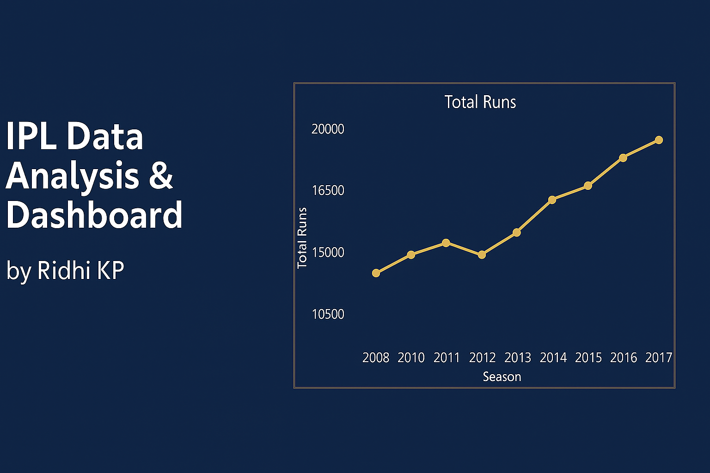
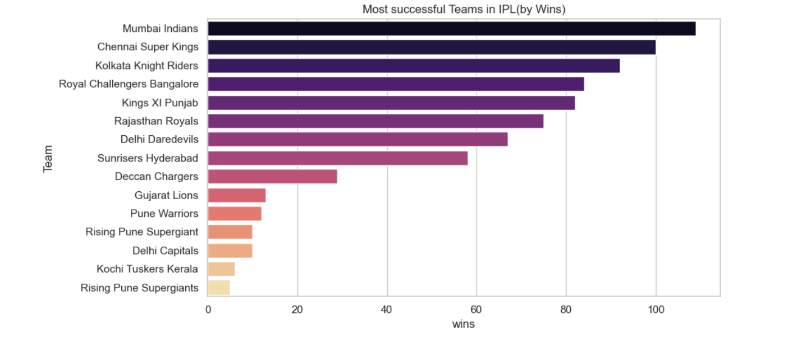
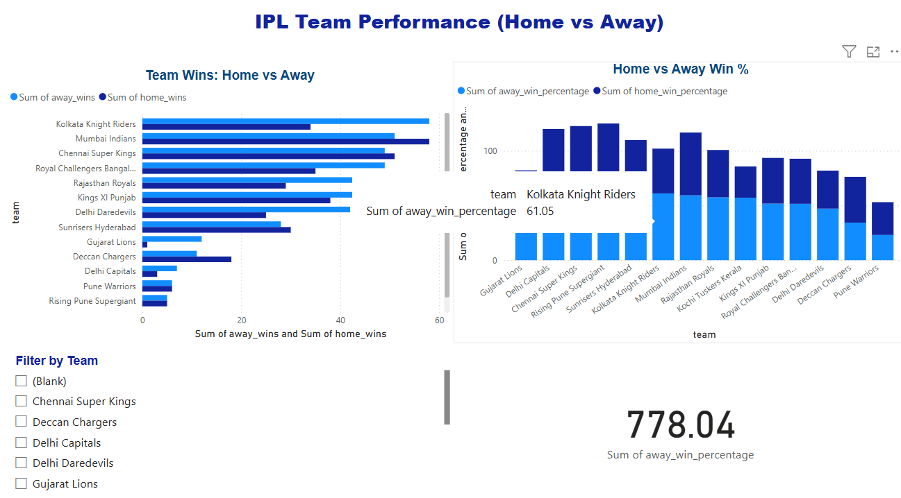
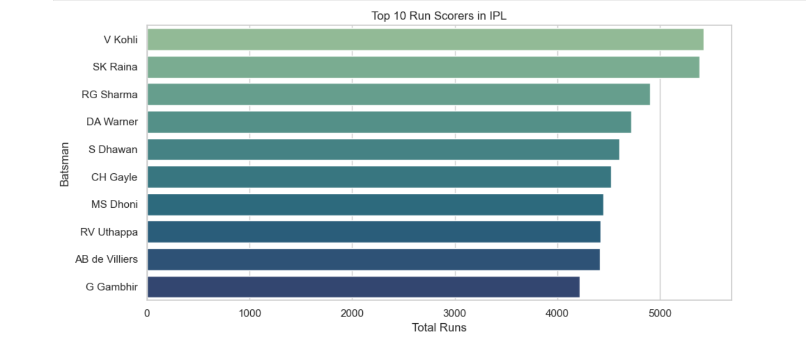

# IPL-data-analysis
Exploratory data analysis of IPL using Python and Power BI.
# 🏏 IPL Data Analysis Project

This project presents an exploratory data analysis (EDA) of the Indian Premier League (IPL), using match-level and delivery-level data. It also includes visual storytelling via Python and Power BI.

---

## 📌 Project Overview

- Analyze IPL match outcomes, scoring trends, and team/player performance
- Discover whether toss decisions impact match results
- Identify top batsmen and bowlers across seasons
- Create visual dashboards using both Python and Power BI

---

## ⚙️ Technologies Used

- Python (Pandas, Matplotlib, Seaborn)
- Jupyter Notebook (Anaconda)
- Power BI (dashboard visuals)
- CSV dataset files (`matches.csv`, `deliveries.csv`)

---

## 📁 Dataset Summary

| File Name         | Description                            |
|------------------|----------------------------------------|
| `matches.csv`     | Match-level info (toss, winner, result) |
| `deliveries.csv`  | Ball-by-ball delivery data              |

---

## 📊 Key Insights

- Toss winners won approximately **XX%** of matches.
- Most teams **prefer to field first** after winning the toss.
- **Run totals per season** show increasing scoring trends.
- **Top batsmen and bowlers** are consistent performers across years.

---

## 📸 Visuals

### 📌 Project Banner  

### 🥇 Top Teams Overview  

### 🏆 Team Performance Comparison  

### 🔝 Top 10 Run Scorers  

---

## 🚀 How to Run

### ▶️ Option 1: Jupyter Notebook
1. Clone this repository or download the ZIP
2. Open `IPL_Data_Analysis.ipynb` in Jupyter Notebook
3. Run all cells to see analysis and charts

### 📊 Option 2: Power BI Dashboard
- Open `IPL_Data_Analysis_Dashboard.pdf` to view exported dashboard
- (Optional) Load `.pbix` in Power BI Desktop if available

---

## 💼 Use Case

This project is ideal for:
- Showcasing data analysis skills in interviews
- Building a portfolio as an aspiring data analyst
- Demonstrating Python and Power BI synergy

---

## 🙌 Acknowledgments

- Data from [Kaggle IPL Dataset](https://www.kaggle.com/datasets)
- Built by: [Ridhi KP]
-           Aspiring Data anlyst 
- Linkedin: [www.linkedin.com/in/ridhi-kp-055787309]

---
